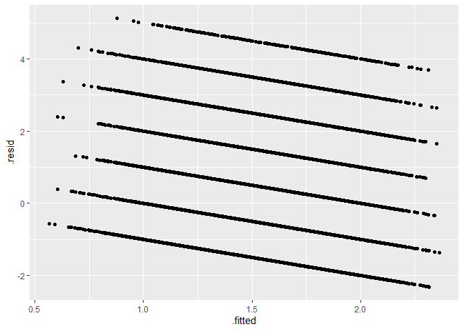

Exercise-11-git-markdown
================
MM
2024-12-20

# Downloading packages :

``` r
library(dplyr)
```

    ## 
    ## Attaching package: 'dplyr'

    ## The following objects are masked from 'package:stats':
    ## 
    ##     filter, lag

    ## The following objects are masked from 'package:base':
    ## 
    ##     intersect, setdiff, setequal, union

``` r
library(tidyverse)
```

    ## ── Attaching core tidyverse packages ──────────────────────── tidyverse 2.0.0 ──
    ## ✔ forcats   1.0.0     ✔ readr     2.1.5
    ## ✔ ggplot2   3.5.1     ✔ stringr   1.5.1
    ## ✔ lubridate 1.9.3     ✔ tibble    3.2.1
    ## ✔ purrr     1.0.2     ✔ tidyr     1.3.1

    ## ── Conflicts ────────────────────────────────────────── tidyverse_conflicts() ──
    ## ✖ dplyr::filter() masks stats::filter()
    ## ✖ dplyr::lag()    masks stats::lag()
    ## ℹ Use the conflicted package (<http://conflicted.r-lib.org/>) to force all conflicts to become errors

``` r
library(broom)
library(haven)
x<-read_sav("data/ESS9e03_2.sav")
```

# Having a look at the dataset :

``` r
head(x)
```

    ## # A tibble: 6 × 572
    ##   name      essround edition proddate    idno cntry      dweight pspwght pweight
    ##   <chr>        <dbl> <chr>   <chr>      <dbl> <chr+lbl>    <dbl>   <dbl>   <dbl>
    ## 1 ESS9e03_2        9 3.2     23.11.2023    27 AT [Austr…   0.581   0.218   0.302
    ## 2 ESS9e03_2        9 3.2     23.11.2023   137 AT [Austr…   1.06    0.413   0.302
    ## 3 ESS9e03_2        9 3.2     23.11.2023   194 AT [Austr…   1.38    2.27    0.302
    ## 4 ESS9e03_2        9 3.2     23.11.2023   208 AT [Austr…   0.993   0.386   0.302
    ## 5 ESS9e03_2        9 3.2     23.11.2023   220 AT [Austr…   0.377   1.03    0.302
    ## 6 ESS9e03_2        9 3.2     23.11.2023   254 AT [Austr…   1.48    0.576   0.302
    ## # ℹ 563 more variables: anweight <dbl>, nwspol <dbl+lbl>, netusoft <dbl+lbl>,
    ## #   netustm <dbl+lbl>, ppltrst <dbl+lbl>, pplfair <dbl+lbl>, pplhlp <dbl+lbl>,
    ## #   polintr <dbl+lbl>, psppsgva <dbl+lbl>, actrolga <dbl+lbl>,
    ## #   psppipla <dbl+lbl>, cptppola <dbl+lbl>, trstprl <dbl+lbl>,
    ## #   trstlgl <dbl+lbl>, trstplc <dbl+lbl>, trstplt <dbl+lbl>, trstprt <dbl+lbl>,
    ## #   trstep <dbl+lbl>, trstun <dbl+lbl>, vote <dbl+lbl>, prtvtcat <dbl+lbl>,
    ## #   prtvtdbe <dbl+lbl>, prtvtdbg <dbl+lbl>, prtvtgch <dbl+lbl>, …

# Data preparation

### Finding the variables in the documentation :

- age -\> agea</br>
- sex -\> gndr -\> to recode : 1 female; 0 male </br>
- employment relationship -\> emplrel</br>
- marital status -\> marsts -\> to be recoded into 3 groups</br>
- subjective income -\> hincfel</br>
- religious attendance -\> rlgatnd \_\> recode</br>

### Selecting the variables we need and creating a dataset :

``` r
df<-select(x,
           age = agea,
           sex = gndr,
           emplrel,
           marsts,
           subjinc = hincfel,
           rlgatnd,
           cntry
           )
```

### Quickly exploring the variables in question :

``` r
table(as_factor(df$sex))
```

    ## 
    ##      Male    Female No answer 
    ##     23020     26499         0

``` r
table(df$sex)
```

    ## 
    ##     1     2 
    ## 23020 26499

Since female is coded as 2, and male as 1 we can just substract 1

``` r
df<-mutate(df, sex=sex-1)
```

``` r
table(df$sex)
```

    ## 
    ##     0     1 
    ## 23020 26499

``` r
table(df$emplrel)
```

    ## 
    ##     1     2     3 
    ## 39131  5014   831

``` r
df.emplrel<-as.factor(df$emplrel)
table(as_factor(df$marsts))
```

    ## 
    ##                                                    Legally married 
    ##                                                               1173 
    ##                                In a legally registered civil union 
    ##                                                                166 
    ##                                                  Legally separated 
    ##                                                                533 
    ##                             Legally divorced/Civil union dissolved 
    ##                                                               4301 
    ##                                         Widowed/Civil partner died 
    ##                                                               4752 
    ## None of these (NEVER married or in legally registered civil union) 
    ##                                                              14439 
    ##                                                     Not applicable 
    ##                                                                  0 
    ##                                                            Refusal 
    ##                                                                  0 
    ##                                                         Don't know 
    ##                                                                  0 
    ##                                                          No answer 
    ##                                                                  0

``` r
table(df$marsts)
```

    ## 
    ##     1     2     3     4     5     6 
    ##  1173   166   533  4301  4752 14439

### Recoding marital status :

#### 1or2;3or4or5;6or66or77or88or99</br>

Eventually this code will transform NA into 3rd category</br> There
haven’t been restrictions about that so we keep it !

``` r
df<-mutate(df,marsts=ifelse(marsts %in% c(1,2),1,
                            ifelse(marsts %in% c(3,4,5),2,3)))
table(df$marsts)
```

### Recoding religion attendance :

``` r
df<-mutate(df,rlgatnd = 7-rlgatnd)
table(df$rlgatnd)
```

    ## 
    ##     0     1     2     3     4     5     6 
    ## 16603  9707 11405  4904  4945  1180   389

# \[QUESTION 2.1\]

## Report the percentage of females in the sample : 53.51%.

``` r
female<-round(nrow(filter(df,sex==1))/nrow(df),4)*100
```

    ## [1] 53.51

# \[QUESTION 2.2\]

## Report the percentage of separated, divorced or widowed individuals in the sample, after recoding marital status : 19.36%.

``` r
prop.table(table(df$marsts))
nonmarried<-round(nrow(filter(df,marsts==2))/nrow(df),4)*100
```

    ## [1] 19.36

# \[QUESTION 2.3\]

## Report average religious attendance in the sample, after recoding it, and treating it as a continuous measurement : 1.53%.

``` r
avg_rlgatnd<-round(mean(df$rlgatnd,na.rm=TRUE),2)
```

    ## [1] 1.53

# 3. Write a multiple linear regression model :

Including an interaction term :

``` r
df<-mutate(df,sexmar=df$sex*df$marsts)
```

# \[QUESTION 3\]

## Provide the formula of your model, in R syntax :

``` r
m1<-lm(rlgatnd~age+sex+emplrel+marsts+subjinc+sexmar,data=df)
```

# 4. Interpret regression results :

## Straightforward model summary :

``` r
summary(m1)
```

    ## 
    ## Call:
    ## lm(formula = rlgatnd ~ age + sex + emplrel + marsts + subjinc + 
    ##     sexmar, data = df)
    ## 
    ## Residuals:
    ##     Min      1Q  Median      3Q     Max 
    ## -2.3145 -1.2598 -0.2600  0.8358  5.1234 
    ## 
    ## Coefficients:
    ##               Estimate Std. Error t value Pr(>|t|)    
    ## (Intercept) -0.0654142  0.0729092  -0.897  0.36962    
    ## age          0.0128108  0.0004059  31.562  < 2e-16 ***
    ## sex          0.5892988  0.0791593   7.444 9.91e-14 ***
    ## emplrel      0.0494949  0.0169585   2.919  0.00352 ** 
    ## marsts       0.1675245  0.0217635   7.697 1.42e-14 ***
    ## subjinc      0.1209663  0.0082451  14.671  < 2e-16 ***
    ## sexmar      -0.1156798  0.0282331  -4.097 4.19e-05 ***
    ## ---
    ## Signif. codes:  0 '***' 0.001 '**' 0.01 '*' 0.05 '.' 0.1 ' ' 1
    ## 
    ## Residual standard error: 1.428 on 44050 degrees of freedom
    ##   (5462 observations deleted due to missingness)
    ## Multiple R-squared:  0.03855,    Adjusted R-squared:  0.03842 
    ## F-statistic: 294.4 on 6 and 44050 DF,  p-value: < 2.2e-16

## Fancy model output :

``` r
texreg::screenreg(m1)
```

    ## 
    ## =========================
    ##              Model 1     
    ## -------------------------
    ## (Intercept)     -0.07    
    ##                 (0.07)   
    ## age              0.01 ***
    ##                 (0.00)   
    ## sex              0.59 ***
    ##                 (0.08)   
    ## emplrel          0.05 ** 
    ##                 (0.02)   
    ## marsts           0.17 ***
    ##                 (0.02)   
    ## subjinc          0.12 ***
    ##                 (0.01)   
    ## sexmar          -0.12 ***
    ##                 (0.03)   
    ## -------------------------
    ## R^2              0.04    
    ## Adj. R^2         0.04    
    ## Num. obs.    44057       
    ## =========================
    ## *** p < 0.001; ** p < 0.01; * p < 0.05

All coefficients are statistically significant both under p\<0.001 and
p\<0.05. However, both R-squared and adjusted R-squared are super low.
Hence, the model has a low predictive ability.

# \[QUESTION 4.1\]

## Do females report higher religious attendance than males,independently of age, employment status, marital status or subjective income? (Answer Yes or No.)

## Yes

This is what the positive coefficient of <b>sex</b> variable indicates.

# \[QUESTION 4.2\]

## Does the model support the view that economic insecurity increases religious attendance?

## Yes

The coefficient for income self-assessment is positive thus the more
insecure respondents are, the more religious they are. Same for
employment. Employed are less religious than those who work
independently.

# \[QUESTION 4.3\]

## How do you interpret the interaction in the model?

Interaction coefficient in general : 0 for men. So it is controlling for
women measuring how women marriage status affect their religiousness.
Basically, since its negative the less married the women is the less she
will be religious. Whereas if she lives or has lived with a man, she
tends to be more religious.

# 5. Diagnose a linear regression model

Firstly, it is worth mentioning that the adjusted R-squared is super low
which means that only 4% of variation in religiousness is explained by
the predictors.

# \[QUESTION 5\]

## According to its residuals, how biased is the model, and what does that mean in terms of its capacity to predict religious attendance from our list of predictors?

``` r
m1_aug<-augment(m1)
p <- ggplot(data = m1_aug,
            mapping = aes(x = .fitted, y = .resid))
p + geom_point()
```

<!-- -->
The residuals vs fitted plot indicates that the model is super biased
residuals are not randomly distributed around 0 and higher residuals are
associated with lower fitted values.

Note that the `echo = FALSE` parameter was added to the code chunk to
prevent printing of the R code that generated the plot.
